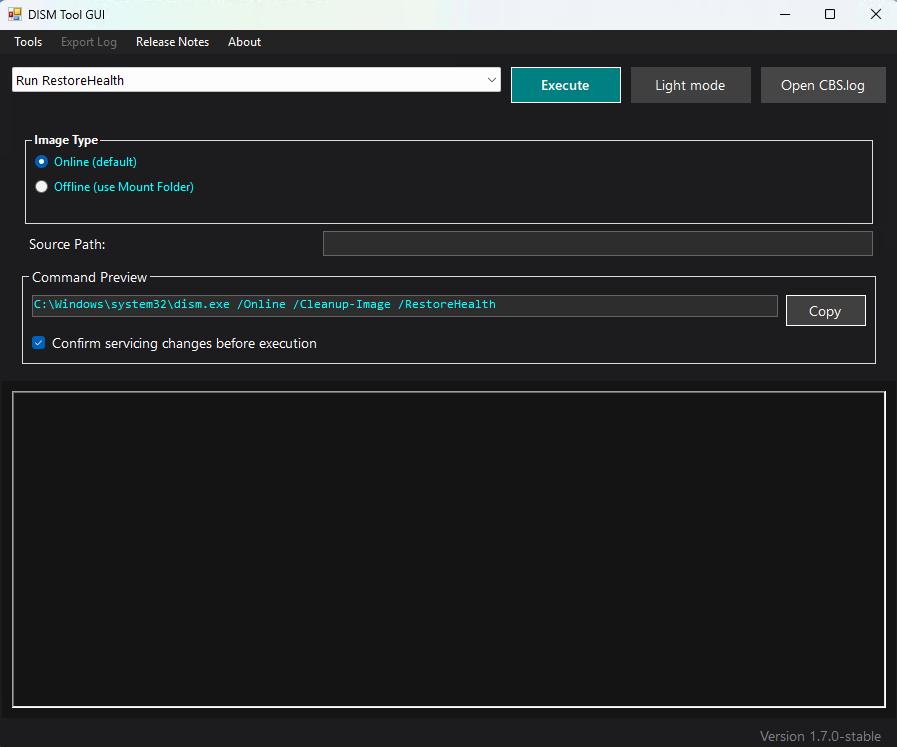
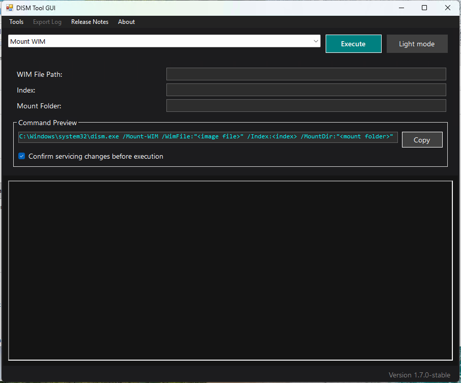
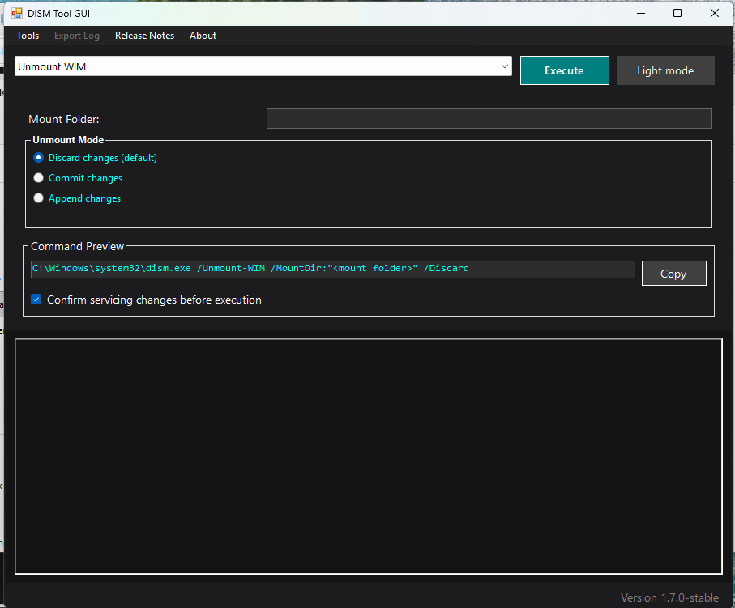
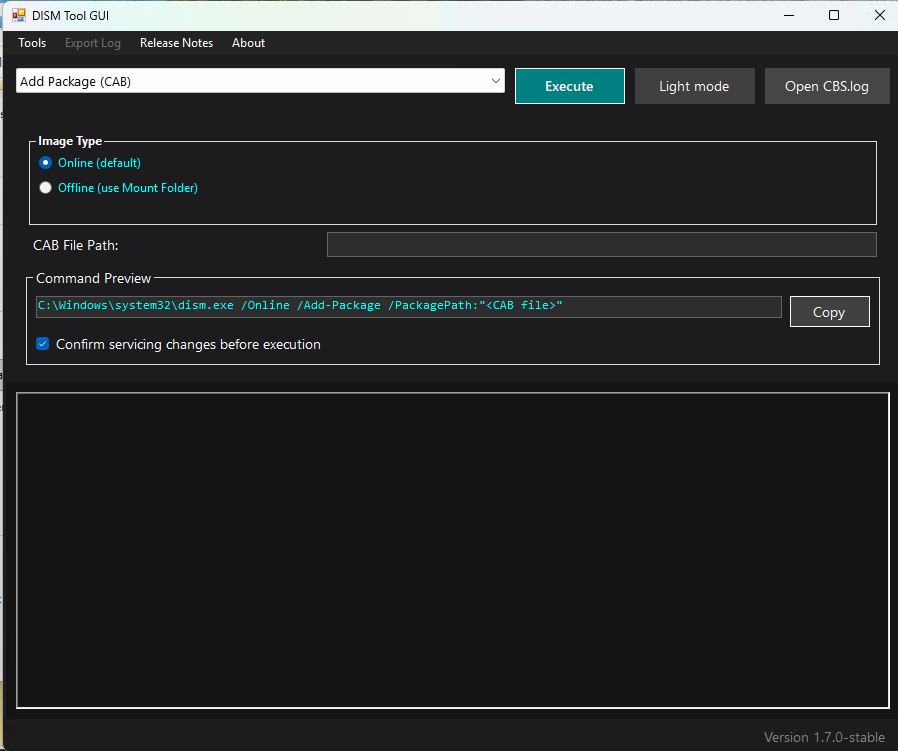
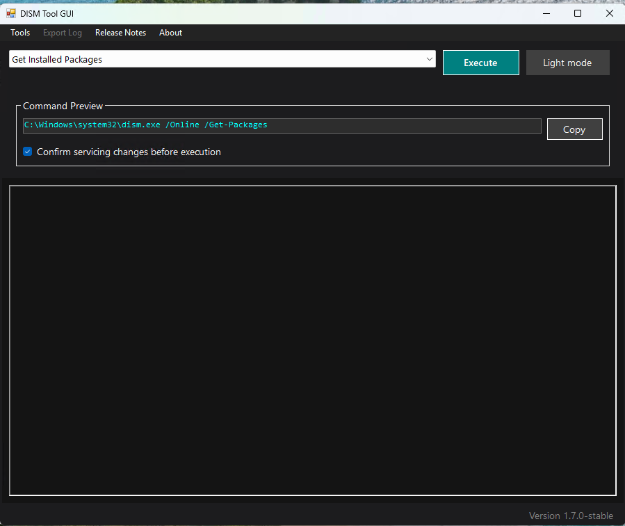
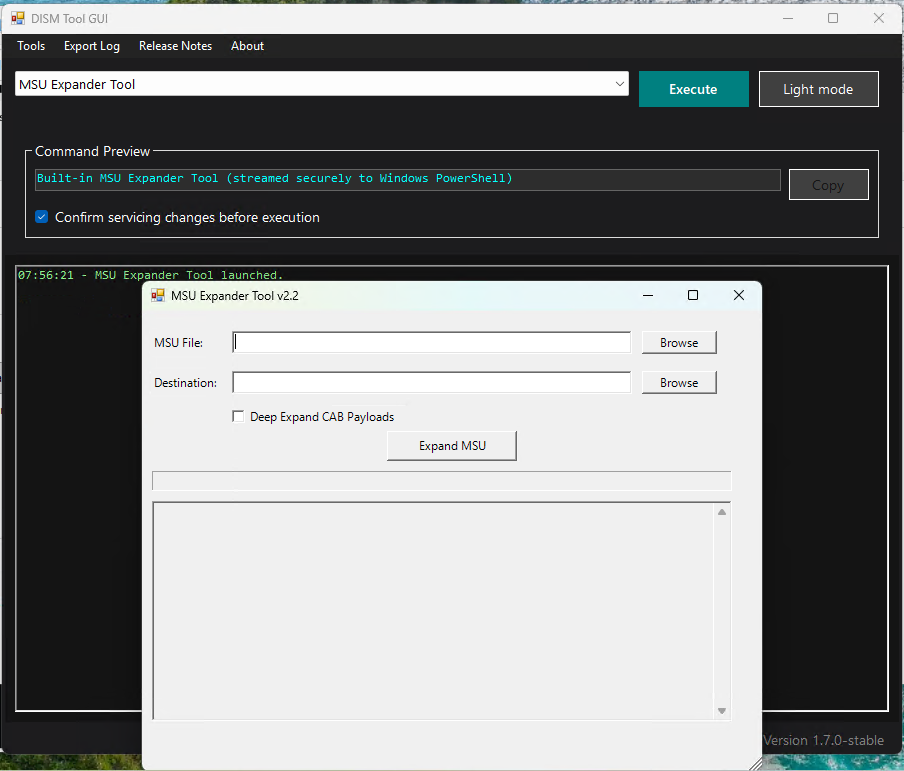

# DISM Tool GUI

DISM Tool GUI is a Windows desktop front end for common **DISM**, **System File Checker**, component recovery, and offline-registry operations. It combines guided inputs, live output, image management, component export, and diagnostic tools in one responsive light/dark interface.

> [!IMPORTANT]
> The application requests administrator privileges at startup because Windows servicing commands require elevation. Review the command preview before making changes to a system or image.

## Highlights

### Windows servicing

- Repair the running system or an offline Windows image with `RestoreHealth`.
- Mount and unmount WIM images with positive-index and empty-folder validation.
- Add CAB or MSU packages from a typed path or file browser, or remove installed packages from supported targets.
- List packages installed on the running Windows installation.
- Export an image index directly to another WIM file.
- Run `sfc /scannow` or the read-only `sfc /verifyonly` check.

| Mount a WIM image | Unmount and commit or discard |
|:---:|:---:|
|  |  |

| Add a CAB or MSU package | List installed packages |
|:---:|:---:|
|  |  |

### WIM / ESD Image Inspector

Open **Tools → Image Servicing → WIM / ESD Image Inspector** to:

- view every image index in a WIM or ESD file;
- compare edition name, description, architecture, version, and size;
- send the selected file and index back to the Mount or Export workflow;
- avoid guessing or manually entering image indexes.

### Mounted Image Manager

Open **Tools → Image Servicing → Mounted Image Manager** to:

- refresh the list of mounted Windows images;
- view image file, index, access mode, mount directory, and status;
- open the selected mount directory in File Explorer;
- remount a recoverable image;
- commit or discard changes while unmounting;
- clean resources belonging to corrupted, unrecoverable mount points.

Both image tools are hosted inside the main application workspace. WIM images can also be mounted read-only from the standard **Mount WIM** workflow.

### Integrated component toolkit

Open **Tools → Component Toolkit** for:

- **Component Export** — search every matching WinSxS component version, copy the selected payload and manifests into an isolated export, optionally export matching registry branches, and create an SFCFix package;
- **WinSxS File Search** — search recursively for an exact filename and copy either its component identity or complete path;
- **Driver File Collector** — preview matching DriverStore and WinSxS folders with estimated sizes, then copy them into a new timestamped destination without clearing earlier exports;
- **SFCFix Package & Run** — download or select SFCFix, review its SHA-256 and Authenticode status, select a generated package, and launch it only after an explicit warning.

Every component tool uses the same in-window workspace and shared themed log. File searches and copies can be cancelled, and cancelled exports leave their partial timestamped folder visible for inspection rather than deleting it automatically.

### Registry Hive Manager

Open **Tools → Advanced → Registry Hive Manager** to load offline registry files under a validated `HKLM` or `HKU` mount name, open them in Registry Editor, and unload them safely. The app tracks hives it loaded during the current session and prevents shutdown while one remains mounted.

### Windows logs

Use **Tools → Logs** to open `CBS.log`, `DISM.log`, or `SetupAPI.dev.log` from their standard Windows locations.

### Command safety

- Live preview updates as command fields and options change.
- Commands can be copied to the clipboard for review or reuse.
- Servicing changes require confirmation by default.
- Destructive mount actions use confirmation dialogs with the affected path.
- The main window cannot close while a servicing command is active.
- Component and hive exports always use a new timestamped folder and never erase an existing export root.
- Registry hives can only be unloaded by the app when they were loaded by the current app session.
- SFCFix downloads never execute automatically and display source, hash, and signature information before launch.

### MSU Expander Tool

- Extract an `.msu` package to a selected folder.
- Optionally expand CAB payloads into `CAB_Extracted`.
- Keep CAB output separated by relative path to prevent name collisions.
- View progress and extraction output without freezing the window.

## Quick start

1. Download the newest package from [GitHub Releases](https://github.com/emmandesu/DISMToolGUI/releases).
2. Extract the downloaded archive to a local folder.
3. Run `DismToolGui.exe` and approve the Windows UAC prompt.
4. Select an operation, complete the visible fields, and review **Command Preview**.
5. Select **Execute** and keep the application open until the operation finishes.

## Supported operations

| UI operation | Target | What it does |
|---|---|---|
| Run RestoreHealth | Online or offline | Repairs the component store; accepts an optional repair source |
| Mount WIM | Image file | Mounts a selected WIM index into an existing empty directory |
| Unmount WIM | Mounted image | Discards, commits, or commits and appends changes |
| Add Package (CAB / MSU) | Online or offline | Adds a CAB or MSU selected in the file browser or entered as a path |
| Get Installed Packages | Online | Lists packages installed on the running system |
| Remove Package | Online or offline | Removes a package by its DISM package identity |
| Export WIM | Image file | Exports a selected index directly to a destination WIM |
| MSU Expander Tool | Package file | Extracts MSU contents and optionally expands nested CAB payloads |
| SFC - Scannow | Online | Verifies protected system files and repairs detected problems |
| SFC - VerifyOnly | Online | Verifies protected system files without performing repairs |
| Component Export | WinSxS and registry | Exports a selected component version, manifests, optional registry keys, and repair package |
| WinSxS File Search | WinSxS folder | Finds an exact filename and reports component identities and full paths |
| Driver File Collector | DriverStore and WinSxS | Previews and collects matching folders into an isolated export |
| SFCFix Package & Run | Repair package | Downloads or selects SFCFix, verifies file identity details, and launches a selected package after confirmation |
| Registry Hive Manager | Offline registry file | Loads, opens, tracks, and unloads offline hives under HKLM or HKU |

## Common workflows

### Inspect and export an image

1. Open **Tools → Image Servicing → WIM / ESD Image Inspector**.
2. Browse to the source image and select **Inspect**.
3. Select the required edition and choose **Use selected index**.
4. The main window opens the appropriate Mount or Export workflow with the image and index filled in.
5. Choose a destination WIM, review the preview, and execute the export.

### Service an offline image

1. Create an empty mount directory.
2. Select **Mount WIM**, provide the WIM file and index, and mount it.
3. Select a supported operation and choose **Offline (use Mount Folder)**.
4. When servicing is complete, open **Tools → Image Servicing → Mounted Image Manager** or select **Unmount WIM**.
5. Choose **Commit** to save changes or **Discard** to abandon them.

### Repair Windows with a source image

1. Select **Run RestoreHealth**.
2. Choose the online system or an offline mount folder.
3. Optionally enter a repair source.
4. Review the generated DISM command and execute it.

When a repair source is supplied, the current workflow adds `/LimitAccess`, so DISM does not fall back to Windows Update.

## Requirements

- 64-bit Windows with DISM and SFC available
- .NET Framework 4.8
- Administrator privileges
- Enough free disk space for mounting, exporting, or expanding images and packages

## Safety notes

- Keep a backup of important WIM/ESD files before committing servicing changes.
- A mount directory must exist and be empty before mounting an image.
- **Commit** writes changes to the image; **Discard** permanently abandons uncommitted changes.
- Do not shut down Windows or terminate DISM while an operation is running.
- **Clean stale mounts** is intended for corrupted, unrecoverable mount points; healthy or recoverable mounts should be handled normally.
- Unload every offline registry hive before closing the application or touching its backing file.
- SFCFix is third-party software. Confirm the displayed source, SHA-256, and signature status before running it, and save your work because it may reboot Windows.
- Only download releases from this repository or another source you trust—the application runs elevated.

## Troubleshooting

| Problem | Suggested action |
|---|---|
| An image index is rejected | Use the Image Inspector and select an index from the detected list |
| A WIM will not mount | Confirm the file exists, the index is positive, and the mount directory is empty |
| A mounted image is inaccessible | Open Mounted Image Manager, refresh the list, and try **Remount** |
| RestoreHealth or package servicing fails | Review the live output and open `CBS.log` from the main window |
| A component search takes a long time | WinSxS searches and size calculations can be cancelled safely from the tool workspace |
| A hive will not unload | Close Registry Editor and any process using the mounted key, then try again |
| SFCFix shows an untrusted signature | Do not run it until you have independently verified the displayed source and SHA-256 |
| Text is difficult to read | Switch between light and dark mode; existing log entries are recolored automatically |
| UAC appears every time | This is expected because the application manifest requires administrator privileges |

## Current limitations

- **Get Installed Packages** currently queries the running system only.
- Active servicing commands cannot be cancelled from the GUI; this avoids interrupting DISM during a critical write operation.
- Component-tool searches and file copies can be cancelled; active DISM servicing commands remain intentionally non-cancellable.
- SFCFix is an external interactive utility and may open its own console after it is launched from the integrated workspace.
- Package installation accepts individual CAB and MSU files; the MSU Expander remains available when package contents must be extracted instead.
- Direct online MSU installation requires Windows 11, version 21H2 or newer; older Windows targets require offline MSU servicing.

## Feedback and issues

If you find a reproducible bug, open a [GitHub issue](https://github.com/emmandesu/DISMToolGUI/issues) and include:

- the selected operation;
- whether the target was online or offline;
- the generated command preview with sensitive paths removed;
- the DISM/SFC exit code and relevant log output;
- your Windows version and the application version.

Maintained by **Emmanuel Flores**.
